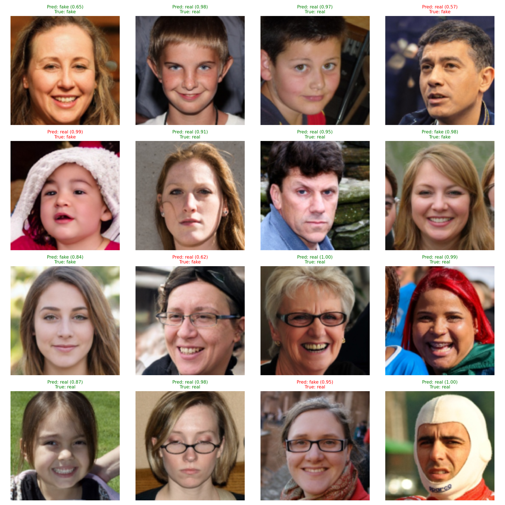

# Real vs Fake Face Classification

Binary classification task: distinguish **real faces (CelebA-HQ)** from **fake faces (StyleGAN-generated)**.

- Framework: PyTorch + ResNet18
- Data: `train.csv` / `valid.csv` + image paths
- Visualization: random prediction grid image

Access to the data

```python
import kagglehub

# Download latest version
path = kagglehub.dataset_download("sachchitkunichetty/rvf10k")

print("Path to dataset files:", path)
```

## Results



## 1. Environment

```bash
pip install -r requirements.txt
```

## 2. Dataset Structure

```text
rvf10k/
    train/
        real/
        fake/
    valid/
        real/
        fake/
    train.csv
    valid.csv
```

Each CSV (`train.csv`, `valid.csv`) must contain at least:

- `label`: `0 = fake`, `1 = real`
- `path`: path **relative to `rvf10k/`**, e.g. `train/real/28609.jpg`

The dataset code uses:

```python
img_path = os.path.join(root_dir, row["path"])  # root_dir = "rvf10k"
```

---

## 3. Training (`train.py`)

`train.py`:

- Loads data from `rvf10k/train.csv` and `rvf10k/valid.csv`
- Trains a ResNet18 binary classifier
- Saves the best model weights to `best_resnet18_rvf10k.pth` (based on validation accuracy)

Run:

```bash
python train.py
```

---

## 4. Prediction & Visualization (`predict.py`)

`predict.py`:

- Loads `best_resnet18_rvf10k.pth`
- Evaluates on the validation set (loss / accuracy)
- Randomly samples several images and generates a prediction grid `pred_examples.png`

Run:

```bash
python predict.py
```

---

## 5. Model & Preprocessing

- Backbone: ResNet18
- Final layer: `fc -> Linear(in_features, 2)` (fake / real)
- Input size: `128 x 128` RGB
- Transform / normalization:

```python
transforms.Resize((128, 128)),
transforms.ToTensor(),
transforms.Normalize(mean=[0.5, 0.5, 0.5],
                     std=[0.5, 0.5, 0.5]),
```

```
::contentReference[oaicite:0]{index=0}
```
